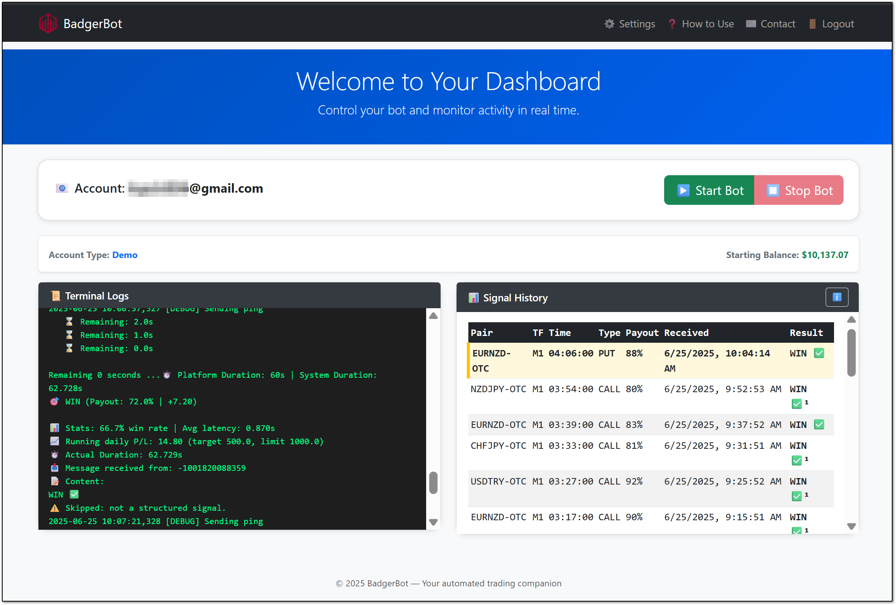
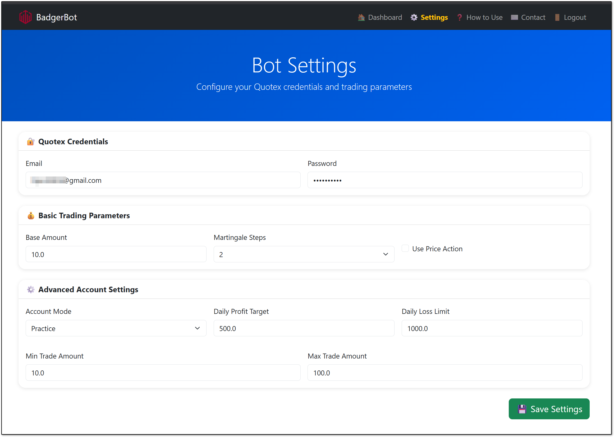
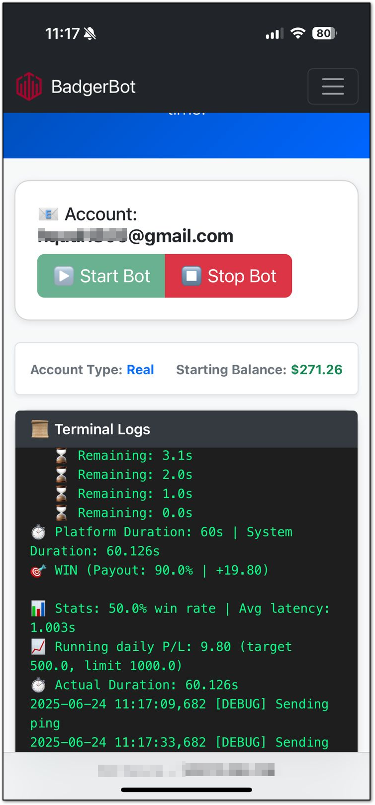

# BadgerBot

## 🚀 Overview

**Badger** is a fully-automated, multi-strategy trading bot designed to execute binary/currency trades on **Quotex** based on signals from Telegram channels, built-in strategies, or both.  
It combines technical analysis, dynamic risk management, Martingale logic, and adaptive time control for reliable trading decisions.

---

## 🔑 Key Highlights

- ✅ **Telegram Mode** — Fully auto-trades based on signals from configured Telegram channels.
- 🧠 **Strategy Mode** — Uses internal strategy consensus to identify optimal trades.
- 🔁 **Hybrid Mode** — Uses Telegram signals but confirms using built-in strategy engine.
- 📊 **Confidence-based Risk Sizing** — Adaptive risk per trade with optional Martingale recovery.
- ⏱ **Candle-Aligned Execution** — Timezone-aware with execution precision.
- 📨 **Telegram Alerts** — Get real-time trade alerts, win/loss results, and strategy decisions.
- 📁 **Trade Logs & CSV History** — For backtesting, review, and audit.

---

## 🧠 Supported Strategies

| Strategy               | Description                                                               | Confidence Threshold |
|------------------------|----------------------------------------------------------------------------|----------------------|
| 📉 Price Action         | Strong-body candle detection over last 3 candles                          | 4.0                  |
| 🔐 EMA + CCI           | EMA trend with CCI divergence + SR zone validation                         | 4.0                  |
| 🔧 Candlestick Patterns | Detects Engulfing, Doji, Hammer, Harami, Morning Star, and more           | 4.0                  |
| 🫛 Pivot + Trend        | Pivot level bounce/reject with 25/75 EMA trend direction                   | 4.0                  |
| 🔮 Ultra Confluence     | Combines EMA + CCI + SR + Patterns + Confidence Scoring                    | 4.0                  |
| 📊 VWAP Bounce          | VWAP bounce with volume confirmation                                       | 3.5                  |
| 🔢 Fibonacci Pullback   | 61.8% / 78.6% retracement with pattern confirmation                        | 3.5                  |
| 🏛 Order Blocks         | Institutional OB detection with confirmation candles                       | 3.5                  |
| 🏦 SMC                  | BOS/CHOCH, Liquidity Sweep, Order Block, and FVG-based confirmations       | 3.5                  |

---


---

## Real-Time Signal System

- Uses an in-memory `deque` for the last 30 signals
- Signals parsed directly in `app.py` using **Telethon**
- No reliance on `signal_history.json`
- API endpoint `/signals` provides live data to frontend


### Signal Format Example:
```
💳 AUDCHF-OTC🔥 M5⌛ 19:35:00🔽 put🚦 Tendência: venda📈 Bkt: 90.47💸 Payout: 86.0%
```


---

## Web UI Pages

### 🔐 Login Page
- Accepts OTP for Telegram authentication
- Session is saved after first login

### 📊 Dashboard
- Start/Stop bot
- Live logs
- Latest Telegram signals

### ⚙️ Settings Page
- Editable fields like:
  - `ACCOUNT_MODE`
  - `DAILY_PROFIT_TARGET`
  - `DAILY_LOSS_LIMIT`
  - `MIN_TRADE_AMOUNT`
  - `MAX_TRADE_AMOUNT`

---

## Starting/Stopping Bot

- Bot is launched via `subprocess.Popen()` from Flask
- Sets correct working directory for stable operation


## 📁 Logging & Backtesting

- All trades are logged to: `logs/trade_history.csv`
- Each strategy debug entry is logged to: `logs/strategy_debug.log`
- Backtest strategies using CSV logs and replay script

---

## 🕒 Timezone-Aware Execution

Badger converts trade times from UTC−3 to your local timezone (`Asia/Qatar` or value in `COUNTRY_TIME`) and executes precisely on candle closes.

---

## ✅ Summary Table

| Feature                     | Supported |
|----------------------------|-----------|
| Multi-Strategy Engine      | ✅        |
| Telegram Signal Trading    | ✅        |
| Risk & Martingale Control  | ✅        |
| Timezone Support           | ✅        |
| Dynamic Confidence System  | ✅        |
| Live Telegram Notifications| ✅        |
| Logging + CSV Export       | ✅        |

---

## 👨‍💻 Contributing

To add your own strategy:

1. Create your strategy under `strategies/your_strategy.py`
2. Register it in `strategy_manager.py`
3. Add toggle in `settings/settings.py`

---

## 🖥 Web UI (Flask)

### Features

- ✅ Start/Stop the trading bot (`Badger.py`)
- ✅ Real-time signal display via Telegram
- ✅ Editable settings from UI (account mode, limits, risk)
- ✅ Telegram OTP authentication
- ✅ View bot logs and signal history

---

## Project Structure

```
BadgerBot/
├── app.py                       # Main Flask application
│── templates/                   # HTML templates (Jinja2)
│── static/                      # CSS/JS and images          
├── Badger                       # Core trading bot
│   ├── settings/
│   │    ├── settings.py         # Trading-related config
│   │    └── config.ini          # Credentials and runtime settings
│   ├── telegram_module          # Parses signals from Telegram
│   │    ├── telegram_listener.py
│   │    └── signal_executor.py

```


## ⚙️ Installation

```bash
pip install -r requirements.txt
```
Or use:

```bash
bash install.sh
```

---

## ✉️ Access

Once running:

- Visit `http://localhost:5000`
- Login with OTP (first time)
- Configure, start, and monitor your bot

---

## 🔧 Future Enhancements

- Win/loss performance chart
- Visual strategy confirmation preview
- Multi-user support
- Signal export system
- Session control interface

---

## 📷 Screenshots






---

**Note:** Not planning to open-source this for now, but feel free to [contact me](mailto:abdullah_b2k@outlook.com) if you're interested.

## 👤 Author

Developed by [**Abdullah Khawaja**](https://abdullahkhawaja.com)

---

## 📄 License

MIT License © 2025 – Badger Trading Project
